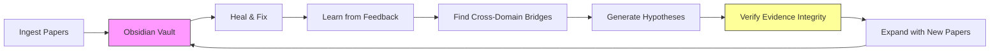

# NexusLink

**Self-Refining Cross-Domain Hypothesis Engine with Evidence Integrity Verification**

Unlike one-shot hypothesis generators, NexusLink runs in iterative cycles where human feedback, autonomous paper discovery, evidence integrity verification, and self-healing knowledge graphs produce increasingly better hypotheses over time.

## Why This Matters

Cross-domain discovery — connecting findings from unrelated fields — is how breakthrough science happens. CRISPR came from connecting bacteriology and genetics. mRNA vaccines bridged immunology and synthetic biology. But researchers are trapped in domain silos: a materials scientist will never read a neuroscience paper that holds the key to their next breakthrough.

NexusLink automates this serendipity, then verifies the evidence chain is solid.

## Architecture



## Quick Start

```bash
# Install
git clone https://github.com/yourusername/nexuslink.git
cd nexuslink
uv sync

# Ingest papers from different domains
uv run nexuslink ingest paper1.pdf
uv run nexuslink ingest 2301.07041  # arxiv ID

# Run a full cycle
uv run nexuslink cycle

# Open wiki/ in Obsidian and explore
# Edit hypotheses, then run another cycle
uv run nexuslink cycle

# Check evidence integrity
uv run nexuslink integrity

# Benchmark: prove cycles beat one-shot
uv run nexuslink benchmark --cycles 3
```

## How It Differs

| Feature | SciAgents (MIT) | ResearchLink | NexusLink |
|---------|----------------|--------------|-----------|
| Knowledge Graph → Hypothesis | ✓ | ✓ | ✓ |
| Cyclical Self-Refinement | ✗ | ✗ | ✓ |
| Human-in-the-Loop via Obsidian | ✗ | ✗ | ✓ |
| Self-Healing Knowledge Graph | ✗ | ✗ | ✓ |
| Autonomous Paper Discovery | ✗ | ✗ | ✓ |
| Evidence Integrity Verification | ✗ | ✗ | ✓ |
| Retraction Checking | ✗ | ✗ | ✓ |

## Benchmark Results

*(Run `nexuslink benchmark --cycles 3` to generate)*

## Citation

```bibtex
@software{nexuslink2026,
  author = {Your Name},
  title = {NexusLink: Self-Refining Cross-Domain Hypothesis Engine},
  year = {2026},
  url = {https://github.com/yourusername/nexuslink}
}
```

## License

MIT
