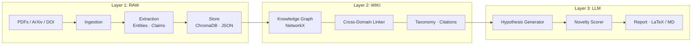

# NexusLink

Cross-domain research hypothesis engine that bridges scientific fields to surface novel, citation-backed research directions.

## Architecture



## Quick Start

```bash
# 1. Clone and install
git clone <repo-url>
cd nexuslink
uv sync

# 2. Run the one-command demo (no PDFs, no API key required)
uv run python demo/run_demo.py

# 3. Open Obsidian → "Open folder as vault" → select demo/demo-vault/
#    Switch to Graph View to explore cross-domain bridges
```

The demo creates a fully-populated Obsidian vault with:

| Folder | Contents |
|--------|----------|
| `papers/` | 3 × Paper.md notes (biology · materials · CS) |
| `concepts/` | 15 × Concept.md notes with `[[wikilinks]]` |
| `hypotheses/` | 1 × cross-domain hypothesis note |
| `reports/` | Full bridge table + hypothesis report |

**Optional** — set `ANTHROPIC_API_KEY` before running to get live Claude-generated hypotheses instead of the pre-written mock.

### Full Pipeline

```bash
# Ingest your own papers
uv run nexuslink ingest path/to/paper.pdf
uv run nexuslink ingest arxiv:2301.00001

# Build cross-domain links
uv run nexuslink link --threshold 0.65

# Generate hypotheses
uv run nexuslink hypothesize --top-n 5

# Full pipeline end-to-end
uv run nexuslink run paper1.pdf arxiv:xxxx doi:10.xxxx

# Run tests & lint
uv run pytest tests/
uv run ruff check .
```

## Why This Matters

Science is siloed. A breakthrough in quantum physics may contain the exact mechanism that solves an open problem in synthetic biology — but no one reads across both literatures. The volume of published research (4+ million papers/year) makes manual cross-domain synthesis impossible.

NexusLink treats cross-domain concept bridges as first-class objects: it embeds papers from different fields into a shared semantic space, detects non-obvious analogies between mechanisms across domains, and uses LLMs to generate structured, falsifiable hypotheses with full citation trails. The output is not a summary — it is a ranked list of experiments that no domain expert would have thought to propose alone.

This is an unsolved problem. Existing tools (Semantic Scholar, ResearchRabbit, Elicit) do retrieval and summarization within a domain. None build cross-domain knowledge graphs and generate hypotheses from the bridges they find.
